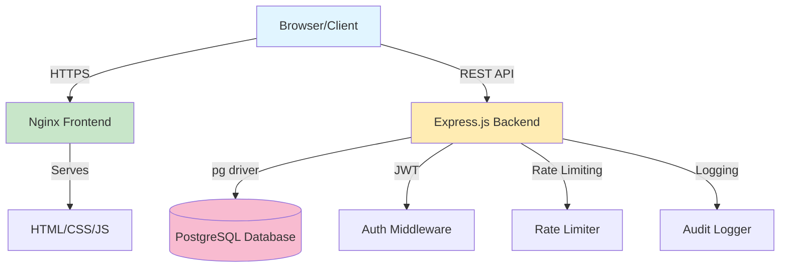
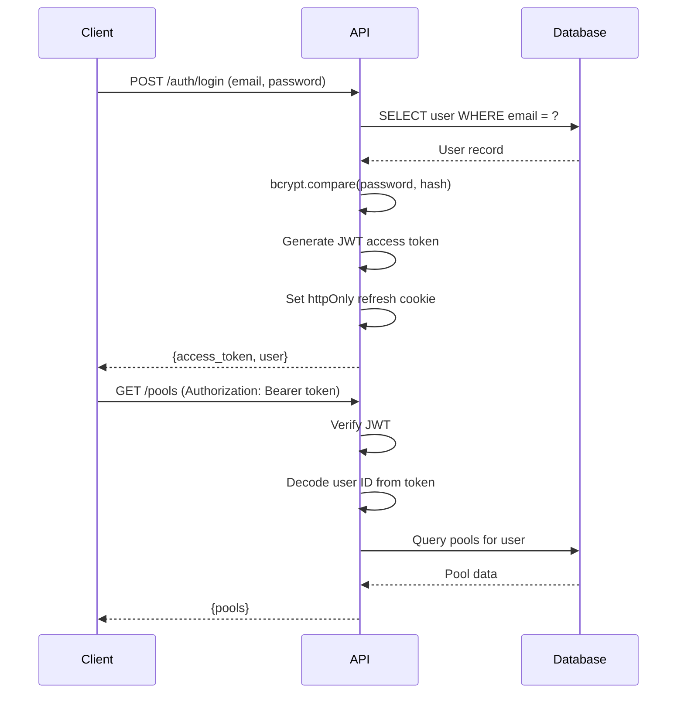
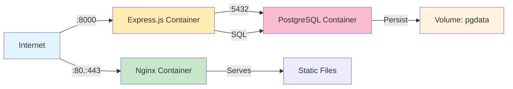

# Architecture Overview

This document provides a comprehensive overview of QuizDojo's system architecture, design decisions, and technical implementation.

## 📋 Table of Contents

- [System Overview](#system-overview)
- [Technology Stack](#technology-stack)
- [Frontend Architecture](#frontend-architecture)
- [Backend Architecture](#backend-architecture)
- [Database Design](#database-design)
- [Authentication & Security](#authentication--security)
- [API Design](#api-design)
- [Deployment Architecture](#deployment-architecture)
- [Performance Considerations](#performance-considerations)
- [Design Decisions](#design-decisions)

---

## 🏗️ System Overview

QuizDojo is a full-stack web application for exam training and learning with spaced repetition.

### High-Level Architecture



### Components

1. **Frontend**: Single-page application (SPA)
   - Static HTML/CSS/JavaScript
   - No framework (Vanilla JS)
   - Served by Nginx

2. **Backend**: REST API
   - Node.js + Express.js
   - JWT authentication
   - PostgreSQL database

3. **Database**: PostgreSQL 16
   - 24 tables
   - UUID primary keys
   - Full ACID compliance

---

## 🔧 Technology Stack

### Frontend

| Technology | Version | Purpose |
|------------|---------|---------|
| HTML5 | - | Structure |
| CSS3 | - | Styling (14 modular files) |
| Vanilla JavaScript | ES6+ | Logic & interactivity |
| CSS Custom Properties | - | Theming (dark/light mode) |

**Why Vanilla JS?**
- Zero build step
- Fast load times
- Easy to understand and modify
- No dependency hell

### Backend

| Technology | Version | Purpose |
|------------|---------|---------|
| Node.js | 20+ | Runtime |
| Express.js | 4.x | Web framework |
| pg | 8.x | PostgreSQL driver |
| bcryptjs | 2.x | Password hashing |
| jsonwebtoken | 9.x | JWT tokens |
| Helmet | 7.x | Security headers |
| express-rate-limit | 7.x | Rate limiting |

### Database

| Technology | Version | Purpose |
|------------|---------|---------|
| PostgreSQL | 16 | Primary database |
| UUID | - | Primary keys |

### Deployment

| Technology | Version | Purpose |
|------------|---------|---------|
| Docker | 20.10+ | Containerization |
| Docker Compose | 1.29+ | Orchestration |
| Nginx | Alpine | Frontend server |

---

## 🖥️ Frontend Architecture

### File Structure

```
site/
├── index.html              (7044 LOC) - Single-page application
├── css/                    (14 files, 914 LOC total)
│   ├── variables.css       - Theme variables
│   ├── base.css            - Reset & foundations
│   ├── typography.css      - Form elements
│   ├── components.css      - Buttons, badges, panels
│   ├── layout.css          - Grid, header, responsive
│   ├── gates.css           - Auth/gate system
│   ├── animations.css      - Keyframes & transitions
│   ├── notifications.css   - Toast system
│   ├── modals.css          - Modal overlay
│   └── modes/              - Mode-specific styles
│       ├── training.css
│       ├── swipe.css
│       ├── exam.css
│       ├── leitner.css
│       └── duel.css
├── datasets/               - Sample question pools
└── images/                 - Static assets
```

### Architecture Pattern: Monolithic SPA

**Why monolithic?**
- Simple deployment (1 file + CSS)
- No build process
- Easy to understand
- Fast iteration

**Structure within `index.html`:**

```javascript
// 1. HTML Structure (~850 LOC)
<body>
  <!-- Gate (Login/Register) -->
  <!-- Header & Navigation -->
  <!-- 6 Mode Tabs: Training, Swipe, Exam, Leitner, Duels, Community -->
  <!-- Modals & Overlays -->
</body>

// 2. Inline JavaScript (~6200 LOC)
<script>
  // i18n translations (DE/EN/RU)
  const I18N = { de: {...}, en: {...}, ru: {...} };

  // Global state
  let currentUser = null;
  let allPools = [];
  let currentPool = null;

  // API client
  async function apiGet(endpoint) { ... }
  async function apiPost(endpoint, body) { ... }

  // UI rendering
  function renderTraining() { ... }
  function renderSwipe() { ... }
  function renderExam() { ... }
  // ... etc

  // Event handlers
  document.addEventListener('DOMContentLoaded', boot);
</script>
```

### State Management

**Simple global variables:**
```javascript
let currentUser = null;      // Logged-in user object
let allPools = [];           // All available pools
let currentPool = null;      // Selected pool
let currentQuestion = null;  // Current question in view
let examState = {...};       // Exam-specific state
```

**Why not React/Vue?**
- Simplicity: No build step, no dependencies
- Performance: Direct DOM manipulation
- Learning curve: Easy for contributors
- Size: ~25KB total CSS, ~200KB HTML+JS

### Responsive Design

3 breakpoints defined in `css/layout.css`:
- **Mobile**: < 640px (stacked layouts)
- **Tablet**: 640px - 900px (2-column grids)
- **Desktop**: > 900px (full layouts)

### Theming

CSS Custom Properties for dark/light themes:

```css
:root {
  --bg: #1a1a1a;           /* Dark mode */
  --text: #f0f0f0;
  --brand: #38a89d;
}

@media (prefers-color-scheme: light) {
  :root {
    --bg: #f9f9f9;         /* Light mode */
    --text: #1a1a1a;
    --brand: #2d8b7d;
  }
}
```

### Internationalization (i18n)

3 languages supported: German, English, Russian

```javascript
const I18N = {
  de: {
    'login.title': 'Anmelden',
    'login.email': 'E-Mail',
    // ... ~300 translation keys
  },
  en: {
    'login.title': 'Login',
    'login.email': 'Email',
    // ...
  },
  ru: {
    'login.title': 'Войти',
    'login.email': 'Эл. почта',
    // ...
  }
};

// Usage
function tr(key) {
  return I18N[currentLang][key] || key;
}
```

---

## ⚙️ Backend Architecture

### File Structure

```
server-mvp/
└── node-app/
    ├── package.json
    ├── src/
    │   ├── index.js        (3302 LOC) - Main server file
    │   ├── rateLimit.js    - Rate limiting middleware
    │   ├── roleRateLimit.js - Role-based rate limits
    │   └── auditLog.js     - Audit logging middleware
    └── tests/
        └── (test files)
```

### Architecture Pattern: Monolithic API

All routes defined in single `index.js` file.

**Why monolithic?**
- Simple to understand
- Easy to navigate
- No module loading overhead
- Fast development

**Structure:**

```javascript
// 1. Dependencies
const express = require('express');
const { Pool } = require('pg');
const jwt = require('jsonwebtoken');
// ...

// 2. Middleware
const { rateLimit } = require('./rateLimit');
const { roleRateLimit } = require('./roleRateLimit');
const { auditLog } = require('./auditLog');

// 3. Database connection
const db = new Pool({
  connectionString: process.env.DATABASE_URL
});

// 4. Helper functions
function requireAuth(req, res, next) { ... }
function requireAdmin(req, res, next) { ... }

// 5. Routes (grouped by resource)
// Auth routes
app.post('/auth/register', ...);
app.post('/auth/login', ...);
app.post('/auth/refresh', ...);
app.post('/auth/logout', ...);

// Pool routes
app.get('/pools', requireAuth, ...);
app.post('/pools', requireAuth, ...);
app.put('/pools/:id', requireAuth, ...);
app.delete('/pools/:id', requireAuth, ...);

// Question routes
// Training routes
// Exam routes
// Leitner routes
// Duel routes
// Gamification routes
// ...

// 6. Server startup
app.listen(PORT, () => {
  console.log(`API running on port ${PORT}`);
});
```

### Middleware Stack

Request flows through middleware in order:

```
Request
  ↓
Helmet (security headers)
  ↓
CORS (cross-origin)
  ↓
Body Parser (JSON)
  ↓
Rate Limiter (IP-based)
  ↓
Route Handler
  ↓
  ├─ requireAuth() ?
  │    ├─ Verify JWT
  │    └─ Load user
  │
  ├─ requireAdmin() ?
  │    └─ Check role
  │
  ├─ roleRateLimit() ?
  │    └─ Check user rate limit
  │
  └─ auditLog() ?
       └─ Log action
  ↓
Business Logic
  ↓
Database Query
  ↓
Response
```

### Error Handling

Consistent error responses:

```javascript
// Success
{
  "data": { ... },
  "message": "Success"
}

// Error
{
  "error": "Error message",
  "code": "ERROR_CODE"
}
```

HTTP status codes:
- `200` - Success
- `201` - Created
- `400` - Bad request (validation error)
- `401` - Unauthorized (not logged in)
- `403` - Forbidden (insufficient permissions)
- `404` - Not found
- `409` - Conflict (duplicate)
- `429` - Too many requests (rate limit)
- `500` - Internal server error

---

## 🗄️ Database Design

### Schema Overview

24 tables organized into domains:

**Core:**
- `users` - User accounts
- `pools` - Question pools
- `questions` - Questions
- `answers` - Answer options

**Learning:**
- `training_history` - Training session history
- `training_later` - "For later" marked questions
- `user_stats` - Per-pool statistics
- `learning_box_sets` - Leitner learning sets
- `learning_box_items` - Items in Leitner boxes

**Exams:**
- `exams` - Exam instances
- `exam_questions` - Questions in exam
- `exam_answers` - User answers in exam

**Gamification:**
- `user_gamification` - XP, levels, streaks
- `badges` - Badge definitions
- `user_badges` - User badge achievements
- `leaderboard_snapshots` - Historical leaderboard data
- `daily_activity` - Daily login tracking

**Social:**
- `friendships` - Friend relationships
- `duels` - 1v1 challenges
- `duel_questions` - Questions in duel
- `duel_answers` - Answers in duel

**System:**
- `audit_log` - Action logging
- `refresh_tokens` - Refresh token tracking (if implemented)

### Key Design Patterns

#### 1. UUID Primary Keys

```sql
CREATE TABLE users (
  id UUID PRIMARY KEY DEFAULT gen_random_uuid(),
  username VARCHAR(50) UNIQUE NOT NULL,
  email VARCHAR(255) UNIQUE NOT NULL,
  -- ...
);
```

**Why UUIDs?**
- Globally unique (no collisions)
- Non-sequential (security)
- Distributed-friendly

#### 2. Timestamps

All tables have `created_at`:

```sql
created_at TIMESTAMP DEFAULT CURRENT_TIMESTAMP
```

Many have `updated_at`:

```sql
updated_at TIMESTAMP DEFAULT CURRENT_TIMESTAMP
```

#### 3. Soft Deletes (Optional)

Not currently implemented, but could add:

```sql
deleted_at TIMESTAMP DEFAULT NULL
```

#### 4. Foreign Keys with Cascades

```sql
CREATE TABLE questions (
  id UUID PRIMARY KEY DEFAULT gen_random_uuid(),
  pool_id UUID NOT NULL REFERENCES pools(id) ON DELETE CASCADE,
  -- ...
);
```

**ON DELETE CASCADE**: When pool deleted, all questions auto-deleted.

### Indexes

Critical indexes for performance:

```sql
-- User lookups
CREATE INDEX idx_users_email ON users(email);
CREATE INDEX idx_users_username ON users(username);

-- Question queries
CREATE INDEX idx_questions_pool_id ON questions(pool_id);
CREATE INDEX idx_questions_source_id ON questions(source_id);

-- Training history
CREATE INDEX idx_training_history_user_pool ON training_history(user_id, pool_id);

-- Gamification
CREATE INDEX idx_user_gamification_user ON user_gamification(user_id);
```

### Query Patterns

**Parameterized queries** (prevent SQL injection):

```javascript
// GOOD
const result = await db.query(
  'SELECT * FROM users WHERE email = $1',
  [email]
);

// BAD (SQL injection!)
const result = await db.query(
  `SELECT * FROM users WHERE email = '${email}'`
);
```

---

## 🔐 Authentication & Security

### Authentication Flow



### Token Strategy

**Two-token system:**

1. **Access Token (JWT)**
   - Short-lived (1 hour)
   - Stored in memory (JavaScript variable)
   - Sent in `Authorization: Bearer <token>` header
   - Contains: user ID, role, username

2. **Refresh Token**
   - Long-lived (7 days)
   - Stored in httpOnly cookie
   - Cannot be accessed by JavaScript
   - Used to get new access token

**JWT Payload:**
```json
{
  "sub": "user-uuid",
  "username": "alice",
  "role": "user",
  "iat": 1234567890,
  "exp": 1234571490
}
```

### Password Security

- **Hashing**: bcryptjs with 10 salt rounds
- **Storage**: Only hash stored, never plain password
- **Validation**: `bcrypt.compare()` for login

```javascript
// Registration
const hash = await bcrypt.hash(password, 10);
await db.query('INSERT INTO users (..., password_hash) VALUES (..., $1)', [hash]);

// Login
const user = await db.query('SELECT * FROM users WHERE email = $1', [email]);
const valid = await bcrypt.compare(password, user.password_hash);
```

### Rate Limiting

**Two levels:**

1. **IP-based** (all requests):
   - 100 requests per 15 minutes
   - Applied globally

2. **Endpoint-specific** (login):
   - 5 attempts per 15 minutes
   - Prevents brute-force

**Implementation:**
```javascript
const loginLimiter = rateLimit({
  windowMs: 15 * 60 * 1000,  // 15 minutes
  max: 5,                     // 5 requests
  message: 'Too many login attempts'
});

app.post('/auth/login', loginLimiter, async (req, res) => {
  // ...
});
```

### Security Headers

Helmet.js adds security headers:

```
Content-Security-Policy: default-src 'self'; script-src 'self' 'unsafe-inline'
X-Frame-Options: SAMEORIGIN
X-Content-Type-Options: nosniff
X-XSS-Protection: 1; mode=block
Strict-Transport-Security: max-age=31536000; includeSubDomains
```

### CORS

Strict CORS configuration:

```javascript
app.use(cors({
  origin: process.env.CORS_ORIGIN || 'http://localhost:3000',
  credentials: true  // Allow cookies
}));
```

---

## 🌐 API Design

### REST Principles

- **Resources**: Nouns (pools, questions, users)
- **HTTP Methods**: GET, POST, PUT, DELETE
- **Status Codes**: Meaningful (200, 201, 400, 401, etc.)
- **JSON**: Request and response bodies

### Endpoint Naming

```
/resources                    GET all, POST create
/resources/:id                GET one, PUT update, DELETE delete
/resources/:id/subresources   Nested resources
```

### Common Patterns

**List resources:**
```http
GET /pools
Response: [
  { id: "...", name: "Pool 1", ... },
  { id: "...", name: "Pool 2", ... }
]
```

**Get single resource:**
```http
GET /pools/:id
Response: { id: "...", name: "Pool 1", questions: [...] }
```

**Create resource:**
```http
POST /pools
Body: { name: "New Pool", ... }
Response: { id: "...", name: "New Pool", ... }
```

**Update resource:**
```http
PUT /pools/:id
Body: { name: "Updated Name" }
Response: { id: "...", name: "Updated Name", ... }
```

**Delete resource:**
```http
DELETE /pools/:id
Response: { message: "Deleted" }
```

For complete API reference, see [API_DOCUMENTATION.md](API_DOCUMENTATION.md).

---

## 🚀 Deployment Architecture

### Docker Compose Stack



### Container Breakdown

**Frontend (Nginx):**
- Image: `nginx:alpine`
- Port: 3000 → 80
- Volume: `./site:/usr/share/nginx/html:ro`
- Purpose: Serve static files

**Backend (Node.js):**
- Build: Custom Dockerfile
- Port: 8000 → 8000
- Environment: From `.env`
- Health check: `/health` endpoint

**Database (PostgreSQL):**
- Image: `postgres:16-alpine`
- Port: 5432 → 5432
- Volume: `pgdata:/var/lib/postgresql/data`
- Init: `schema.sql` runs on first start

### Networking

**Bridge network** (`quizdojo-network`):
- Internal communication between containers
- Service discovery by container name
- Isolated from host

---

## ⚡ Performance Considerations

### Frontend Optimization

**CSS:**
- Modular files (browser caching)
- Gzip compression (Nginx)
- Critical CSS inline (future)

**JavaScript:**
- No framework overhead
- Direct DOM manipulation
- Minimal dependencies

**Images:**
- Lazy loading (future)
- WebP format (future)
- CDN (future)

### Backend Optimization

**Database:**
- Indexes on foreign keys
- Connection pooling (pg Pool)
- Prepared statements

**Caching:**
- No caching currently implemented
- Future: Redis for sessions, leaderboards

**Rate Limiting:**
- Prevents abuse
- Protects database

---

## 🤔 Design Decisions

### Why Monolithic Frontend?

**Pros:**
- ✅ Simple deployment
- ✅ No build step
- ✅ Easy to understand
- ✅ Fast iteration

**Cons:**
- ❌ Large file size (~7000 LOC)
- ❌ No code splitting
- ❌ Harder to test

**Decision**: For this project, simplicity outweighs scalability concerns.

### Why Monolithic Backend?

**Pros:**
- ✅ Easy to navigate
- ✅ No module complexity
- ✅ Fast development

**Cons:**
- ❌ Harder to scale teams
- ❌ Harder to test individual routes

**Decision**: Single-developer project, simplicity preferred.

### Why PostgreSQL over MongoDB?

**Reasons:**
- ✅ Relational data (users → pools → questions)
- ✅ ACID guarantees
- ✅ Complex queries (JOINs)
- ✅ Strong consistency

### Why UUIDs over Auto-Increment IDs?

**Reasons:**
- ✅ Globally unique
- ✅ Non-sequential (security)
- ✅ No collision in distributed systems
- ❌ Slightly larger (16 bytes vs 4 bytes)

### Why httpOnly Cookies for Refresh Tokens?

**Reasons:**
- ✅ Cannot be accessed by JavaScript (XSS protection)
- ✅ Automatically sent with requests
- ✅ Secure flag for HTTPS

---

## 📚 Further Reading

- [Database Schema](DATABASE_SCHEMA.md) - Detailed table definitions
- [API Documentation](API_DOCUMENTATION.md) - Complete endpoint reference
- [Getting Started](GETTING_STARTED.md) - Setup guide
- [Installation](INSTALLATION.md) - Deployment guide

---

**Updated**: 2026-02-08
