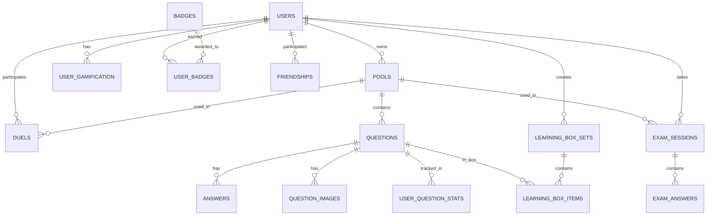

# Database Schema Documentation

Complete reference for the QuizDojo PostgreSQL database schema.

## 📋 Table of Contents

- [Overview](#overview)
- [ER Diagram](#er-diagram)
- [Core Tables](#core-tables)
- [Learning Tables](#learning-tables)
- [Exam Tables](#exam-tables)
- [Gamification Tables](#gamification-tables)
- [Social Tables](#social-tables)
- [Indexes](#indexes)
- [Constraints](#constraints)

---

## 🏗️ Overview

**Database**: PostgreSQL 16
**Total Tables**: 24
**Primary Key Type**: UUID (gen_random_uuid())
**Timestamp Type**: timestamptz (timezone-aware)

### Design Principles

1. **UUID Primary Keys** - Globally unique, non-sequential
2. **Foreign Key Cascades** - Automatic cleanup on delete
3. **Timestamps** - All tables have `created_at`
4. **Indexes** - On foreign keys and query-heavy columns
5. **Check Constraints** - Data integrity at database level

---

## 📊 ER Diagram

---

## 🔐 Core Tables

### users

User accounts and authentication.

| Column | Type | Constraints | Description |
|--------|------|-------------|-------------|
| id | UUID | PK, DEFAULT gen_random_uuid() | Unique user ID |
| username | TEXT | UNIQUE | Username (optional) |
| email | TEXT | UNIQUE, NOT NULL | Email address |
| password_hash | TEXT | NOT NULL | bcrypt hashed password |
| role | TEXT | NOT NULL, CHECK | 'admin' or 'student' |
| display_name | TEXT | | Display name for UI |
| leaderboard_opt_in | BOOLEAN | DEFAULT true | Show on leaderboards |
| created_at | TIMESTAMPTZ | DEFAULT now() | Registration timestamp |

**Indexes:**
- `users_email_idx` (implicit via UNIQUE)
- `users_username_idx` (implicit via UNIQUE)

**Related Tables**: All user-specific tables

---

### pools

Question pools (collections of questions).

| Column | Type | Constraints | Description |
|--------|------|-------------|-------------|
| id | UUID | PK, DEFAULT gen_random_uuid() | Unique pool ID |
| name | TEXT | NOT NULL | Pool name |
| owner_id | UUID | FK users(id) ON DELETE SET NULL | Pool creator |
| created_at | TIMESTAMPTZ | DEFAULT now() | Creation timestamp |
| updated_at | TIMESTAMPTZ | DEFAULT now() | Last update timestamp |

**Indexes:**
- Primary key index on `id`

**Related Tables**: `questions`, `exam_sessions`, `learning_box_sets`, `duels`

---

### questions

Individual questions within pools.

| Column | Type | Constraints | Description |
|--------|------|-------------|-------------|
| id | UUID | PK, DEFAULT gen_random_uuid() | Unique question ID |
| pool_id | UUID | FK pools(id) ON DELETE CASCADE | Parent pool |
| text | TEXT | NOT NULL | Question text |
| lang | TEXT | | Language code (de/en/ru) |
| category | TEXT | | Optional category |
| explanation | TEXT | | Explanation shown after answer |
| source_id | TEXT | | Links multilingual versions |
| created_at | TIMESTAMPTZ | DEFAULT now() | Creation timestamp |

**Indexes:**
- `questions_pool_lang_idx` ON (pool_id, lang)
- `questions_source_id_idx` ON (source_id) WHERE source_id IS NOT NULL

**Related Tables**: `answers`, `question_images`, `exam_answers`, `duel_answers`

**Notes:**
- `source_id` links same question across languages (e.g., DE/EN/RU versions)
- `lang` determines displayed language

---

### answers

Answer options for questions (2-10 per question).

| Column | Type | Constraints | Description |
|--------|------|-------------|-------------|
| id | UUID | PK, DEFAULT gen_random_uuid() | Unique answer ID |
| question_id | UUID | FK questions(id) ON DELETE CASCADE | Parent question |
| text | TEXT | NOT NULL | Answer text |
| is_correct | BOOLEAN | DEFAULT false | Whether answer is correct |
| source_id | TEXT | | Links multilingual answer versions |

**Indexes:**
- `answers_source_id_idx` ON (source_id) WHERE source_id IS NOT NULL

**Related Tables**: `questions`

**Notes:**
- Multiple answers can have `is_correct = true` (multiple-choice questions)
- At least 1 answer must be correct per question (enforced in application)

---

### question_images

Images associated with questions.

| Column | Type | Constraints | Description |
|--------|------|-------------|-------------|
| id | UUID | PK, DEFAULT gen_random_uuid() | Unique image ID |
| question_id | UUID | FK questions(id) ON DELETE CASCADE | Parent question |
| url | TEXT | | External image URL |
| alt | TEXT | | Alt text for accessibility |
| local_path | TEXT | | Local file path |
| sort_order | INT | DEFAULT 0 | Display order |

**Indexes:**
- `question_images_qid_idx` ON (question_id)

---

## 📚 Learning Tables

### user_question_stats

Per-user, per-question statistics.

| Column | Type | Constraints | Description |
|--------|------|-------------|-------------|
| id | UUID | PK | Unique stat ID |
| user_id | UUID | FK users(id) ON DELETE CASCADE | User |
| question_id | UUID | FK questions(id) ON DELETE CASCADE | Question |
| asked_count | INT | DEFAULT 0 | Times asked |
| correct_count | INT | DEFAULT 0 | Times answered correctly |
| streak | INT | DEFAULT 0 | Current correct streak |
| last_seen_at | TIMESTAMPTZ | | Last time seen |
| last_result | TEXT | CHECK ('correct'/'wrong') | Last answer result |

**Constraints:**
- UNIQUE (user_id, question_id)

**Notes:**
- Tracks individual question performance
- Used for adaptive difficulty

---

### learning_box_sets

Leitner learning sets (spaced repetition).

| Column | Type | Constraints | Description |
|--------|------|-------------|-------------|
| id | UUID | PK | Unique set ID |
| user_id | UUID | FK users(id) ON DELETE CASCADE | Owner |
| name | TEXT | NOT NULL | Set name |
| pool_id | UUID | FK pools(id) ON DELETE CASCADE | Source pool |
| mode | TEXT | CHECK ('simple'/'classic'), DEFAULT 'simple' | Learning mode |
| created_at | TIMESTAMPTZ | DEFAULT now() | Creation timestamp |

**Indexes:**
- `learning_box_sets_user_pool_name_idx` UNIQUE ON (user_id, pool_id, name)

**Related Tables**: `learning_box_items`

**Notes:**
- **Simple mode**: No due dates, immediate review
- **Classic mode**: Spaced repetition with due dates (1/2/5/8/14 days)

---

### learning_box_items

Items (questions) within Leitner sets.

| Column | Type | Constraints | Description |
|--------|------|-------------|-------------|
| set_id | UUID | FK learning_box_sets(id) ON DELETE CASCADE | Parent set |
| user_id | UUID | FK users(id) ON DELETE CASCADE | Owner |
| question_id | UUID | FK questions(id) ON DELETE CASCADE | Question |
| box | INT | DEFAULT 1 | Current box (1-5) |
| due_at | TIMESTAMPTZ | | Due date (classic mode only) |

**Constraints:**
- PRIMARY KEY (set_id, user_id, question_id)

**Indexes:**
- `learning_box_items_set_user_idx` ON (set_id, user_id)
- `learning_box_items_due_idx` ON (set_id, user_id, due_at)

**Notes:**
- Box 1-5: Represents learning progress
- Correct answer → move to next box
- Wrong answer → back to box 1

---

### user_wrong_questions

Tracks questions answered incorrectly in training.

| Column | Type | Constraints | Description |
|--------|------|-------------|-------------|
| id | UUID | PK | Unique ID |
| user_id | UUID | FK users(id) ON DELETE CASCADE | User |
| question_id | UUID | FK questions(id) ON DELETE CASCADE | Question |
| wrong_count | INT | DEFAULT 0 | Times answered wrong |
| last_wrong_at | TIMESTAMPTZ | DEFAULT now() | Last wrong answer time |

**Constraints:**
- UNIQUE (user_id, question_id)

**Notes:**
- Used for "Only wrong (48h)" filter in training mode

---

### user_later_questions

Questions marked "for later" by user.

| Column | Type | Constraints | Description |
|--------|------|-------------|-------------|
| id | UUID | PK | Unique ID |
| user_id | UUID | FK users(id) ON DELETE CASCADE | User |
| question_id | UUID | FK questions(id) ON DELETE CASCADE | Question |
| marked_at | TIMESTAMPTZ | DEFAULT now() | When marked |

**Constraints:**
- UNIQUE (user_id, question_id)

**Notes:**
- Users can bookmark questions for review
- Used in training mode filter

---

## 📝 Exam Tables

### exam_sessions

Exam instances.

| Column | Type | Constraints | Description |
|--------|------|-------------|-------------|
| id | UUID | PK | Unique exam ID |
| user_id | UUID | FK users(id) ON DELETE CASCADE | User taking exam |
| pool_id | UUID | FK pools(id) ON DELETE CASCADE | Pool used |
| total_questions | INT | NOT NULL | Number of questions |
| correct_answers | INT | DEFAULT 0 | Correct answer count |
| started_at | TIMESTAMPTZ | DEFAULT now() | Exam start time |
| finished_at | TIMESTAMPTZ | | Exam end time |

**Related Tables**: `exam_answers`

**Notes:**
- `finished_at IS NULL` = exam in progress
- Timer duration calculated from `started_at` and `finished_at`

---

### exam_answers

User answers in exam sessions.

| Column | Type | Constraints | Description |
|--------|------|-------------|-------------|
| id | UUID | PK | Unique ID |
| session_id | UUID | FK exam_sessions(id) ON DELETE CASCADE | Parent exam |
| question_id | UUID | FK questions(id) ON DELETE CASCADE | Question |
| selected_answer_ids | UUID[] | NOT NULL | Array of selected answer IDs |
| is_correct | BOOLEAN | DEFAULT false | Whether answer was correct |

**Notes:**
- `selected_answer_ids` is array for multiple-choice questions
- Evaluated after exam completion

---

## 🏆 Gamification Tables

### user_gamification

User XP, levels, and streaks.

| Column | Type | Constraints | Description |
|--------|------|-------------|-------------|
| user_id | UUID | PK, FK users(id) ON DELETE CASCADE | User |
| xp | NUMERIC(10,2) | DEFAULT 0 | Total experience points |
| level | INT | DEFAULT 0 | Current level |
| last_awarded_at | TIMESTAMPTZ | | Last XP award time |
| updated_at | TIMESTAMPTZ | DEFAULT now() | Last update |

**Indexes:**
- `user_gamification_xp_idx` ON (xp DESC) - for leaderboards

**Notes:**
- XP awarded for correct answers
- Level calculated from XP thresholds

---

### badges

Badge definitions.

| Column | Type | Constraints | Description |
|--------|------|-------------|-------------|
| id | UUID | PK | Unique badge ID |
| key | TEXT | UNIQUE, NOT NULL | Badge identifier (e.g., 'first_correct') |
| name_de | TEXT | NOT NULL | German name |
| name_en | TEXT | NOT NULL | English name |
| description_de | TEXT | NOT NULL | German description |
| description_en | TEXT | NOT NULL | English description |
| icon | TEXT | | Icon emoji or class |

**Related Tables**: `user_badges`

**Notes:**
- Multilingual badge definitions
- `key` used for programmatic badge awards

---

### user_badges

User badge achievements.

| Column | Type | Constraints | Description |
|--------|------|-------------|-------------|
| user_id | UUID | FK users(id) ON DELETE CASCADE | User |
| badge_key | TEXT | FK badges(key) ON DELETE CASCADE | Badge earned |
| earned_at | TIMESTAMPTZ | DEFAULT now() | When earned |

**Constraints:**
- PRIMARY KEY (user_id, badge_key)

**Indexes:**
- `user_badges_user_idx` ON (user_id, earned_at DESC)

---

### user_activity_daily

Daily activity statistics per user per pool.

| Column | Type | Constraints | Description |
|--------|------|-------------|-------------|
| user_id | UUID | FK users(id) ON DELETE CASCADE | User |
| pool_id | UUID | FK pools(id) ON DELETE CASCADE | Pool |
| activity_date | DATE | NOT NULL | Date |
| training_correct | INT | DEFAULT 0 | Training correct answers |
| training_wrong | INT | DEFAULT 0 | Training wrong answers |
| leitner_correct | INT | DEFAULT 0 | Leitner correct answers |
| exam_correct | INT | DEFAULT 0 | Exam correct answers |
| exam_total | INT | DEFAULT 0 | Total exam questions |
| total_answered | INT | DEFAULT 0 | Total questions answered |
| updated_at | TIMESTAMPTZ | DEFAULT now() | Last update |

**Constraints:**
- PRIMARY KEY (user_id, pool_id, activity_date)

**Indexes:**
- `user_activity_daily_user_date_idx` ON (user_id, activity_date DESC)
- `user_activity_daily_pool_date_idx` ON (pool_id, activity_date DESC)

**Notes:**
- Tracks daily progress per learning mode
- Used for activity streaks

---

### leaderboard_snapshots

Historical leaderboard data.

| Column | Type | Constraints | Description |
|--------|------|-------------|-------------|
| id | UUID | PK | Unique snapshot ID |
| scope | TEXT | CHECK ('global'/'weekly'/'pool') | Leaderboard scope |
| pool_id | UUID | FK pools(id) ON DELETE CASCADE | Pool (if scope='pool') |
| period_start | DATE | | Period start (for weekly) |
| period_end | DATE | | Period end (for weekly) |
| computed_at | TIMESTAMPTZ | DEFAULT now() | Snapshot time |
| entries | JSONB | NOT NULL | Leaderboard entries |

**Indexes:**
- `leaderboard_snapshots_scope_time_idx` ON (scope, computed_at DESC)
- `leaderboard_snapshots_period_idx` ON (scope, period_start, period_end)

**Notes:**
- `entries` JSON format: `[{user_id, username, xp, rank}, ...]`
- Snapshots created periodically (e.g., weekly)

---

## 👥 Social Tables

### friendships

Friend relationships between users.

| Column | Type | Constraints | Description |
|--------|------|-------------|-------------|
| id | UUID | PK | Unique friendship ID |
| requester_id | UUID | FK users(id) ON DELETE CASCADE | User who sent request |
| addressee_id | UUID | FK users(id) ON DELETE CASCADE | User who received request |
| status | TEXT | CHECK ('pending'/'accepted'/'declined'), DEFAULT 'pending' | Request status |
| created_at | TIMESTAMPTZ | DEFAULT now() | Request time |

**Constraints:**
- UNIQUE (requester_id, addressee_id)
- CHECK (requester_id != addressee_id) - can't friend yourself
- `friendships_pair_unique_idx` UNIQUE ON (LEAST(...), GREATEST(...)) - prevents duplicate relationships

**Indexes:**
- `friendships_requester_idx` ON (requester_id, status)
- `friendships_addressee_idx` ON (addressee_id, status)

---

### duels

1v1 quiz challenges.

| Column | Type | Constraints | Description |
|--------|------|-------------|-------------|
| id | UUID | PK | Unique duel ID |
| challenger_id | UUID | FK users(id) ON DELETE CASCADE | User who created duel |
| opponent_id | UUID | FK users(id) ON DELETE SET NULL | Opponent (null for open duels) |
| pool_id | UUID | FK pools(id) ON DELETE CASCADE | Pool used |
| question_count | INT | CHECK (3-10), DEFAULT 5 | Number of questions |
| question_ids | JSONB | NOT NULL | Array of question UUIDs |
| status | TEXT | CHECK ('waiting'/'active'/'finished'/'expired') | Duel status |
| is_open | BOOLEAN | DEFAULT false | Open to anyone |
| expires_at | TIMESTAMPTZ | NOT NULL | Expiration time |
| created_at | TIMESTAMPTZ | DEFAULT now() | Creation time |
| finished_at | TIMESTAMPTZ | | Completion time |

**Constraints:**
- CHECK (challenger_id != opponent_id)

**Related Tables**: `duel_answers`, `duel_results`

---

### duel_answers

Answers submitted in duels.

| Column | Type | Constraints | Description |
|--------|------|-------------|-------------|
| duel_id | UUID | FK duels(id) ON DELETE CASCADE | Parent duel |
| user_id | UUID | FK users(id) ON DELETE CASCADE | User answering |
| question_id | UUID | FK questions(id) ON DELETE CASCADE | Question |
| selected_answer_ids | JSONB | DEFAULT '[]' | Selected answers |
| is_correct | BOOLEAN | NOT NULL | Whether correct |
| time_ms | INT | CHECK (>= 0), DEFAULT 0 | Time taken (ms) |
| answered_at | TIMESTAMPTZ | DEFAULT now() | Answer time |

**Constraints:**
- PRIMARY KEY (duel_id, user_id, question_id)

---

### duel_results

Aggregated duel results per user.

| Column | Type | Constraints | Description |
|--------|------|-------------|-------------|
| duel_id | UUID | FK duels(id) ON DELETE CASCADE | Parent duel |
| user_id | UUID | FK users(id) ON DELETE CASCADE | User |
| correct_count | INT | DEFAULT 0 | Correct answers |
| total_time_ms | INT | DEFAULT 0 | Total time taken |
| score | NUMERIC(10,2) | DEFAULT 0 | Calculated score |

**Constraints:**
- PRIMARY KEY (duel_id, user_id)

---

### contests (Future Feature)

Time-limited contests.

| Column | Type | Constraints | Description |
|--------|------|-------------|-------------|
| id | UUID | PK | Unique contest ID |
| name | TEXT | NOT NULL | Contest name |
| pool_id | UUID | FK pools(id) ON DELETE SET NULL | Pool used |
| starts_at | TIMESTAMPTZ | NOT NULL | Start time |
| ends_at | TIMESTAMPTZ | NOT NULL | End time |
| rules | JSONB | DEFAULT '{}' | Contest rules |
| created_at | TIMESTAMPTZ | DEFAULT now() | Creation time |

**Related Tables**: `contest_entries`

---

### contest_entries (Future Feature)

User participation in contests.

| Column | Type | Constraints | Description |
|--------|------|-------------|-------------|
| contest_id | UUID | FK contests(id) ON DELETE CASCADE | Parent contest |
| user_id | UUID | FK users(id) ON DELETE CASCADE | Participant |
| score | NUMERIC(10,2) | DEFAULT 0 | Contest score |
| stats | JSONB | DEFAULT '{}' | Detailed stats |

**Constraints:**
- PRIMARY KEY (contest_id, user_id)

---

## 🔍 Indexes

### Performance-Critical Indexes

**User lookups:**
- `users(email)` - UNIQUE index (login)
- `users(username)` - UNIQUE index (search)

**Question queries:**
- `questions(pool_id, lang)` - Filtered queries
- `questions(source_id)` - Language toggle

**Training:**
- `user_question_stats(user_id, question_id)` - UNIQUE index

**Leitner:**
- `learning_box_items(set_id, user_id, due_at)` - Due date queries

**Leaderboards:**
- `user_gamification(xp DESC)` - Rankings

**Friendships:**
- `friendships(requester_id, status)` - Sent requests
- `friendships(addressee_id, status)` - Received requests

---

## ⚖️ Constraints

### Check Constraints

- `users.role IN ('admin','student')`
- `learning_box_sets.mode IN ('simple','classic')`
- `user_question_stats.last_result IN ('correct','wrong')`
- `duels.question_count BETWEEN 3 AND 10`
- `duels.status IN ('waiting','active','finished','expired')`
- `friendships.status IN ('pending','accepted','declined')`
- Self-referential checks: `challenger_id != opponent_id`, `requester_id != addressee_id`

### Foreign Key Cascades

**ON DELETE CASCADE** (child deleted when parent deleted):
- Most relationships (questions → answers, pools → questions, etc.)

**ON DELETE SET NULL** (orphan but don't delete):
- `pools.owner_id` - Pool persists if owner deleted
- `duels.opponent_id` - Duel persists if opponent deleted

---

## 🔧 Migrations

Schema is initialized via `schema.sql` on first database start.

For future migrations:
1. Create migration file: `migrations/001_add_feature.sql`
2. Apply manually or via migration tool
3. Update `schema.sql` for fresh installations

---

## 📚 Related Documentation

- [Architecture Overview](ARCHITECTURE.md)
- [API Documentation](API_DOCUMENTATION.md)
- [Getting Started](GETTING_STARTED.md)

---

**Updated**: 2026-02-08
